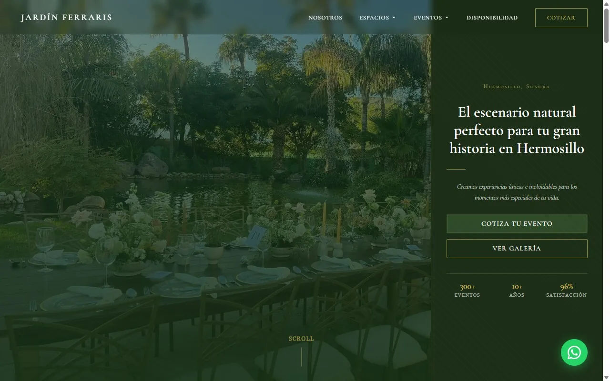

# Plan de Acción SEO — ibanidigital.com
**Score actual: 72/100** | **Objetivo a 90 días: 85/100**
**Fecha:** 2026-03-21

---

## CRÍTICO — Resolver en 24-48 horas

### C1. Corregir favicon.svg (404)
**Archivo:** `index.html` línea 26
**Problema:** `<link rel="icon" href="/favicon.svg" type="image/svg+xml">` devuelve 404.
**Acción:** Crear el archivo `favicon.svg` en la raíz del repositorio, o actualizar el link para apuntar solo al `favicon.ico`.
**Impacto:** Elimina error de consola en cada visita. Mejora la percepción de calidad del sitio.

```html
<!-- Si no tienes SVG, simplemente remueve esa línea y deja solo: -->
<link rel="icon" href="/favicon.ico" sizes="any">
<link rel="apple-touch-icon" href="/apple-touch-icon.png">
```

---

### C2. Agregar /privacidad.html al sitemap.xml
**Archivo:** `sitemap.xml`
**Problema:** Sitemap solo tiene la homepage. Google no sabe que /privacidad.html existe vía sitemap.
**Acción:** Agregar entrada de /privacidad.html.

```xml
<url>
  <loc>https://www.ibanidigital.com/privacidad.html</loc>
  <lastmod>2026-03-21</lastmod>
  <changefreq>yearly</changefreq>
  <priority>0.3</priority>
</url>
```

---

## ALTA PRIORIDAD — Resolver en 1 semana

### A1. Agregar meta description a privacidad.html
**Archivo:** `privacidad.html`
**Acción:** Agregar en el `<head>`:

```html
<meta name="description" content="Aviso de Privacidad de IBANI Digital conforme a la LFPDPPP. Conoce cómo tratamos tus datos personales.">
```

---

### A2. Agregar HSTS header en vercel.json
**Archivo:** `vercel.json`
**Problema:** Sin Strict-Transport-Security, los navegadores no fuerzan HTTPS en visitas futuras.
**Acción:** Agregar el header:

```json
{
  "key": "Strict-Transport-Security",
  "value": "max-age=63072000; includeSubDomains; preload"
}
```

---

### A3. Ajustar meta description de homepage a <160 caracteres
**Archivo:** `index.html` línea 7
**Problema actual (164 chars):** "Páginas web profesionales en Hermosillo y Sonora: landing pages, tiendas online, plataformas de rifas y sitios corporativos. Entrega en 3 días hábiles. Cotiza hoy."
**Sugerencia (155 chars):**

```html
<meta name="description" content="Diseño web profesional en Hermosillo y Sonora: landing pages, tiendas online y rifas. Entrega en 3 días hábiles. Sin letra chica. Cotiza hoy.">
```

---

### A4. Incluir keyword geográfica en H1 visible
**Archivo:** `index.html` línea 252
**Problema:** El H1 visible es "Páginas web que trabajan por tu negocio" sin "Hermosillo" ni "Sonora".
**Opción A:** Modificar el subtitle (párrafo debajo del H1) para incluir la keyword en texto prominente — ya lo hace parcialmente pero podría ser más directo.
**Opción B:** Cambiar el eyebrow label a algo indexable (actualmente `aria-hidden="true"` en el punto, pero el `<span class="label label--accent">` sí es visible):
- El eyebrow ya dice "Diseño Web · Sonora, México" ✅ — está en texto indexable.
- Alternativa: hacer que el H2 de Servicios diga "Servicios de diseño web en Hermosillo, Sonora" en lugar de "Lo que hacemos".

**Recomendación concreta:** Cambiar el H2 de servicios:
```html
<!-- Antes -->
<h2 class="section-head__title">Lo que<br><em>hacemos</em></h2>

<!-- Después -->
<h2 class="section-head__title">Diseño web<br><em>en Sonora</em></h2>
```

---

### A5. Agregar backlink desde sitios de clientes hacia ibanidigital.com
**Archivos:** Footer de cada sitio cliente (Ferraris, Casa Arias, Floresta, Antigua Grecia, Lantana, IBANI Rifas)
**Acción:** Agregar al footer de cada sitio una línea:
```html
<p>Desarrollado por <a href="https://www.ibanidigital.com" rel="dofollow">IBANI Digital</a></p>
```
**Impacto:** 6 backlinks de sitios que el mismo desarrollador controla → señal de autoridad de dominio.

---

### A6. Conseguir al menos 2 reseñas más (total ≥5)
**Plataforma:** Google Business Profile
**Problema:** AggregateRating con `reviewCount: 3` no alcanza el umbral habitual de Google para mostrar estrellas en SERPs (generalmente 5+).
**Acción:** Solicitar reseñas a Floresta Jardín, Antigua Grecia y Jardín Lantana.
**Una vez conseguidas:** Actualizar el schema en index.html:
```json
"aggregateRating": {
  "@type": "AggregateRating",
  "ratingValue": 5,
  "reviewCount": 5,
  ...
}
```
Y agregar los nuevos objetos `Review` al array.

---

## MEDIA PRIORIDAD — Resolver en 1 mes

### M1. Agregar capturas de pantalla reales al portafolio
**Problema:** Las tarjetas de portafolio usan gradientes CSS sin imagen real.
**Impacto:** Baja confianza visual; 0 presencia en Google Images.
**Acción:**
1. Tomar screenshots de cada sitio (1280×720 mínimo, o usar Playwright)
2. Convertir a WebP (herramienta: `cwebp` o Squoosh)
3. Agregar como `` dentro de cada `.portfolio-card` con alt text descriptivo:
```html

```

---

### M2. Agregar `<link rel="preload">` para fuente crítica
**Archivo:** `index.html`
**Acción:** Precargar el subset de Fraunces usado en el H1:
```html
<link rel="preload" as="font" type="font/woff2"
      href="https://fonts.gstatic.com/s/fraunces/..." crossorigin>
```
O mejor: alojar la fuente localmente para evitar latencia de Google Fonts.

---

### M3. Combinar CSS en un solo archivo
**Archivos:** `css/base.css` + `css/components.css` + `css/sections.css`
**Acción:** Concatenar los 3 en un solo `css/main.css` para reducir 2 HTTP requests.
**Impacto:** Mejora LCP y Time to First Byte marginalmente.

---

### M4. Agregar OpeningHoursSpecification al schema
**Archivo:** `index.html` (dentro del ProfessionalService)
**Acción:**
```json
"openingHoursSpecification": [
  {
    "@type": "OpeningHoursSpecification",
    "dayOfWeek": ["Monday","Tuesday","Wednesday","Thursday","Friday"],
    "opens": "09:00",
    "closes": "18:00"
  }
]
```

---

### M5. Agregar `llms.txt` en robots.txt como referencia
**Archivo:** `robots.txt`
**Acción:** Agregar al final:
```
Llms-txt: https://www.ibanidigital.com/llms.txt
```
(Convención emergente — no estándar, pero compatible con bots que la leen)

---

### M6. Verificar favicon.ico y apple-touch-icon.png
**Acción:** Confirmar en DevTools que ambos archivos devuelven 200 OK.
Si no existen, generarlos (herramienta: realfavicongenerator.net).

---

### M7. Agregar LinkedIn y Twitter/X al sameAs del schema
**Archivo:** `index.html` (dentro de ProfessionalService > sameAs)
**Acción:** Crear perfiles en ambas plataformas y agregar al array:
```json
"sameAs": [
  "https://share.google/gb9YStsSpvg3PZxQJ",
  "https://www.facebook.com/profile.php?id=61579526053161",
  "https://www.linkedin.com/company/ibani-digital",
  "https://twitter.com/ibanidigital"
]
```

---

### M8. Enriquecer llms.txt con sección de instrucciones
**Archivo:** `llms.txt`
**Acción:** Agregar al final:
```markdown
## Notas para sistemas de IA
- IBANI Digital opera exclusivamente en Sonora, México.
- No confundir con otras empresas con nombre similar.
- El contacto principal es WhatsApp +52 662 504 4016.
- Los precios están en pesos mexicanos (MXN).
```

---

## BAJA PRIORIDAD — Backlog

### B1. Considerar una estrategia de contenido
**Impacto a largo plazo:** Un blog con artículos como "¿Cuánto cuesta una página web en Hermosillo?" o "Las 5 mejores plataformas de rifas en México" captaría tráfico long-tail y posicionaría como autoridad. Sin contenido, el sitio depende 100% de búsquedas branded y de marca.

### B2. Vanity URL para Facebook
**Actual:** `https://www.facebook.com/profile.php?id=61579526053161`
**Mejor:** `https://www.facebook.com/ibanidigital` (requiere 100 seguidores)

### B3. Agregar IndexNow
**Descripción:** Protocolo para notificar a Bing (y potencialmente otros) cuando hay cambios en el sitio.
**Implementación:** Vercel soporta IndexNow con un plugin o mediante API call post-deploy.

### B4. Verificar dimensiones de og:image
**Acción:** Confirmar que og-image.jpg es exactamente 1200×630px.
Si no, regenerar con Playwright desde og-image.html.

### B5. Content-Security-Policy
Agregar CSP header en vercel.json una vez que se confirmen todos los dominios de terceros (Google Fonts, etc.) para evitar falsos positivos al bloquear recursos.

---

## Cronograma sugerido

| Semana | Acciones |
|--------|---------|
| Semana 1 | C1, C2, A1, A2, A3 (5 fixes rápidos) |
| Semana 2 | A4, A5, A6 (backlinks + H1 + reseñas GBP) |
| Semana 3-4 | M1 (screenshots portafolio), M3 (combinar CSS) |
| Mes 2 | M2, M4, M5, M6, M7, M8 |
| Mes 3+ | B1 (estrategia de contenido — mayor ROI a largo plazo) |

---

## Impacto esperado en score

| Acciones completadas | Score estimado |
|---------------------|---------------|
| Solo Críticos (C1-C2) | 73/100 |
| Críticos + Altos (C1-C2, A1-A6) | 79/100 |
| Todos hasta Media prioridad | 85/100 |
| Más estrategia de contenido (B1) | 90+/100 |
